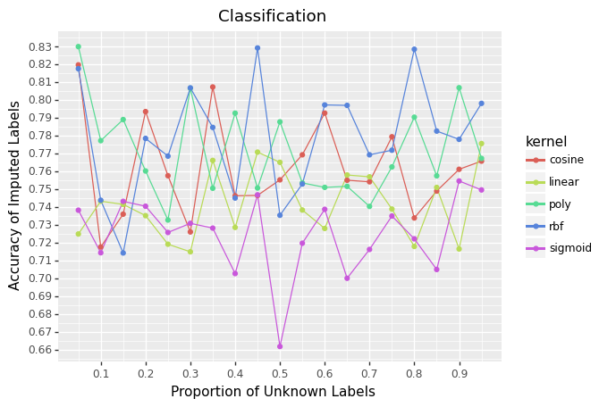
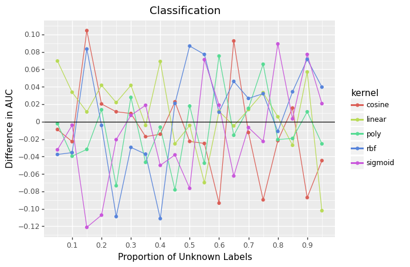
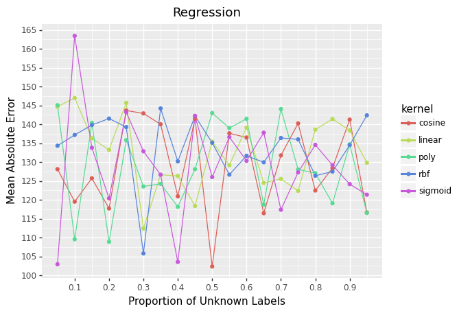
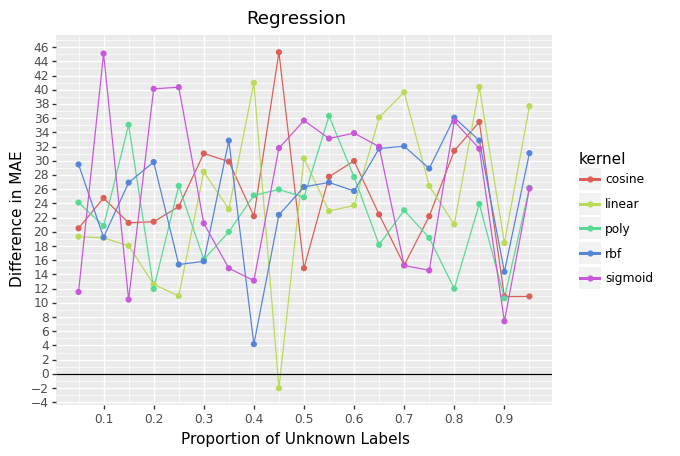

## Repo Overview

For all supervised machine learning projects, computing an accurate
label is critical. It is fairly common to have bespoke data feeds for
each client. If a client is simply not sending the required data, an
accurate label is impossible.

Semi-supervised machine learning presents an alternative option. The
problem clients X matrix is combined with known clients’ X and Y
matrices to impute labels. These imputed labels are combined with the
known labels to build a better final model. At least that is the pitch
of semi-supervised approaches.

In this repo, I test this claim with a few questions.

- How accurate are the imputed labels?
- Does imputing labels lead to a final model with better performance
  metrics?
- If most of the labels are unknown, does the approach still work?
- Does this approach work for both classification and regression?

## Simulation Setup

Basic outline:

- Step 1: Create data. Either classification or regression.
- Step 2: Train a model on just known data.
- Step 3: Learn a latent variable representation using both labeled and
  unlabeled data’s X.
- Step 4: Impute labels using the closes five data points with known
  labels.
- Step 5: Compare imputation to true labels of unlabeled data.
- Step 6: Train a model with imputed labels added in.
- Step 7: Compare performance metrics of the two models (step 2 and
  step 6) on unseen data.

For each iteration, only fifty thousand data points are created (labeled
and unlabeled). This process is repeated varying the proportion of data
with unknown labels. Kernel PCA with different kernels is used at step
three. Each combination of settings is repeated 5 times and an average
is computed to reduce variability of metrics.

## Results

### Data

The first few rows look like

<table border="1" class="dataframe">
  <thead>
    <tr style="text-align: right;">
      <th></th>
      <th>type</th>
      <th>prop</th>
      <th>kernel</th>
      <th>matchMetric</th>
      <th>modelMetric</th>
    </tr>
  </thead>
  <tbody>
    <tr>
      <th>0</th>
      <td>classification</td>
      <td>0.05</td>
      <td>cosine</td>
      <td>0.81968</td>
      <td>-0.008973</td>
    </tr>
    <tr>
      <th>1</th>
      <td>classification</td>
      <td>0.05</td>
      <td>linear</td>
      <td>0.72480</td>
      <td>0.069621</td>
    </tr>
    <tr>
      <th>2</th>
      <td>classification</td>
      <td>0.05</td>
      <td>poly</td>
      <td>0.82992</td>
      <td>-0.002351</td>
    </tr>
    <tr>
      <th>3</th>
      <td>classification</td>
      <td>0.05</td>
      <td>rbf</td>
      <td>0.81752</td>
      <td>-0.037626</td>
    </tr>
    <tr>
      <th>4</th>
      <td>classification</td>
      <td>0.05</td>
      <td>sigmoid</td>
      <td>0.73816</td>
      <td>-0.032248</td>
    </tr>
  </tbody>
</table>

For classification, match metric is the accuracy of the imputed labels
and model metric is the difference in AUC between the two models. For
regression, match metric is mean absolute error of the imputed response
variable and model metric is the difference in M.A.E. of the two models.

### Classification

    <ggplot: (150481123160)>

No kernel stands out as superior to any other kernel.

    <ggplot: (150472685283)>

In this graph, higher is better. Zero means no improvement in AUC.

Again, no kernel stands out as good. When 15% of the data has unknown
labels, the semi-supervised approach improved the final model by .10
AUC. A major improvement. For 15%, other kernels caused a major
degradation in performance. In general, this is a mixed bag. Sometimes
the approached helped a great deal. Sometimes it hurt a great deal.

### Regression

    <ggplot: (150481739773)>

For regression, lower is better. Zero means perfect predictions.

Similar to above. No kernel stands out.

    <ggplot: (150481890169)>

In this graph, lower is better. Zero means no improvement in mean
absolute error. Negative values mean a reduction in M.A.E.

The results are worse for regression. The semi-supervised approach
failed the vast majority of the time.

## Closing Thoughts

The project takes a roll-your-own approach to semi-supervised.
Scikit-learn has added two semi-supervised learners and an additional
meta estimator that turns any supervised approach (SVM, random forest,
boosting, etc) into a semi-supervised approach. These tools are more
robust than what I have done here.
